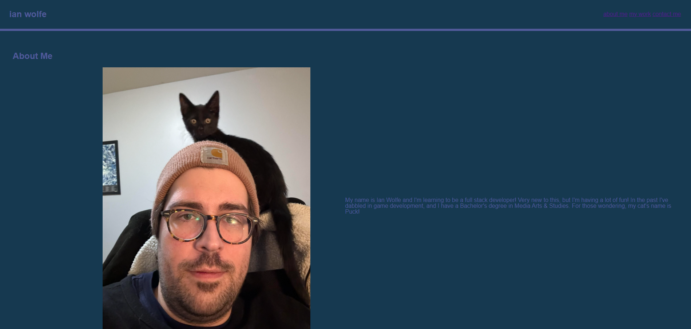

# nwbc-enw-portfolio

## Description

This was designed to be my first attempt at a portfolio for my work during my process of learning to be a full stack developer. Builind this was a challenging and showed me that I have a lot to learn as far as
CSS is concerned, but I had a lot of fun working on it. I'm learning to really enjoy the feeling of when something that didn't make sense to me suddenly clicks.

The links on the navigation bar direct you to their associated sections of the page, and clicking on a picture of my previous work will take you to their github page.

## Table of Contents (Optional)

N/A

## Installation

N/A

## Usage

Provide instructions and examples for use. Include screenshots as needed.

## Credits

Ian Wolfe

Shouts out to W3 schools, MDN, and any website that tells you hexcodes for all the help. CSS for being added to my "Must study" list.

## License

N/A

## Badges

N/A

## Features

The screenshots of my previous work are links to the projects themselves!

## How to Contribute

N/A

## Tests

N/A
